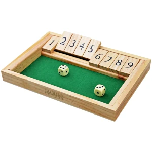

# Shut the box

After a drunken argument about the odds of winning a game of Shut the Box, this script was created to determine the odds of winning according to several strategies

## The Rules

I believe there are multiple versions of Shut the Box around, so this is what I'm referring to. 



A player has a wooden box with 9 shuttable boxes, numbered 1 to 9. They roll 2 dice and then close boxes that add up to the sum of their roll. Once the sum of the remaining boxes is 6 or less, the player can choose to roll a single dice. The player wins if they manage to shut all the boxes. 

## Strategies

This script tests the following strategies, 

* Random: Pick any valid combination at random. 
* Highest: Choose the combination that closes the highest number possible
* Lowest: Choose the lowest available numbers.
* Middle: Choose the middle available numbers (e.g. if the available numbers are 1, 2, 3, 4, 5, choose 2 and 3).
* Odd: Choose the highest odd number available, if any. If there are no odd numbers available, choose the highest even number available.
* Even: Choose the highest even number available, if any. If there are no even numbers available, choose the highest odd number available.

## Running the script

This script requires Python 3.7+ Run the sript with 

```python -m main```

